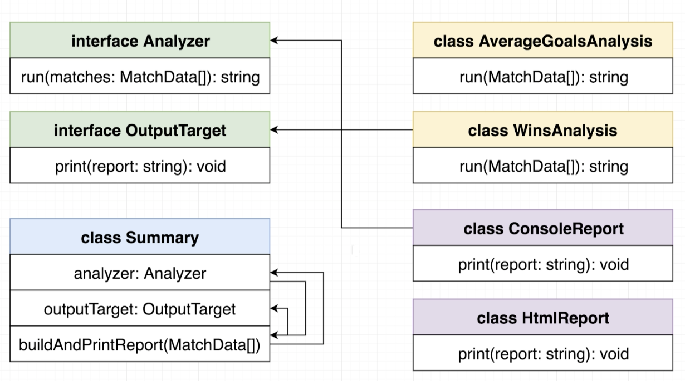
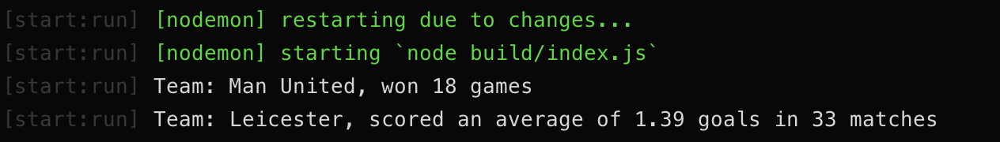

# Stats Analyzer

## Description
Modular Stats Analyzer tool to provide flexibility on input data as well as output reporting styles



## Currently Supports

### Input
* CSV input [CsvFileReader]

### Output
* HTML [HtmlReport]
* Console [ConsoleReport]

### Analysis
* Number of Wins in a Football match [WinsAnalysis]
* Average Goals in a Football match [AverageGoalsAnalysis]



## To Start
`npm install`  
`npm run start`  

### Sample Analysis
#### To run an HTML report on wins
Inside of `index.ts`, add the following line with your desired Team:
```
const summary = Summary.winsAnalysisHtmlReport('Team-Name');
summary.buildAndPrintReport(matchReader.matches);
```

#### To run a Console report on wins
Inside of `index.ts`, add the following line with your desired Team:
```
const summary = Summary.winsAnalysisConsoleReport('Team-Name');
summary.buildAndPrintReport(matchReader.matches);
```

#### To run a Console report on average goals
Inside of `index.ts`, add the following line with your desired Team:
```
const summary = Summary.averageGoalsAnalysisConsoleReport('Team-Name');
summary.buildAndPrintReport(matchReader.matches);
```

## To Expand Support For Other Analyses
1. Implement the following method(s) to adhere to the Analyzer interface:
* `run(matches: MatchData[]): string;`

> Credit to Stephen Grider's course: Typescript: The Complete Developer's Guide where the initial implementation was designed.
> https://www.udemy.com/course/typescript-the-complete-developers-guide/